# Methods

## Pipeline Overview

Unlike the companion repository (using pre-computed recount3 counts), this 
analysis performs alignment from raw reads: FastQC → fastp (adapter 
trimming) → salmon (pseudoalignment) → tximport → DESeq2, using all 30 
samples from GSE104704 (8 Young, 10 Old, 12 AD) reanalyzed against a 
current reference (GENCODE v47), rather than the original 2018 alignment.

## Model Fit Check

Dispersion estimates from the fitted DESeq2 model were inspected via 
`plotDispEsts()` to confirm the model's mean-variance relationship fit 
the data appropriately before proceeding to differential expression 
testing.

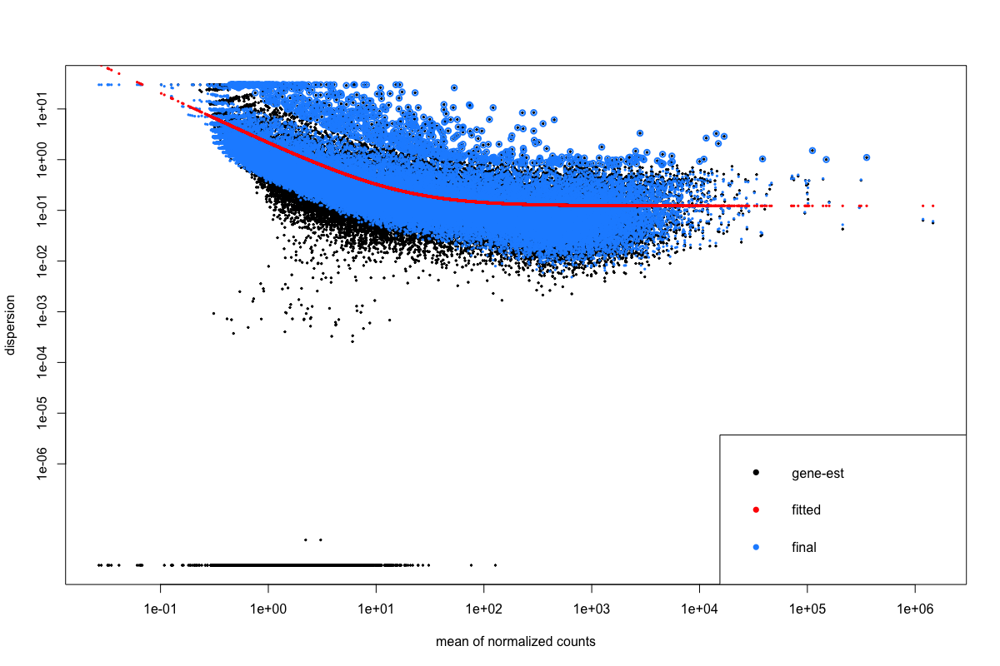

## Quality Control and Adapter Trimming

FastQC analysis of raw reads revealed consistent TruSeq adapter 
contamination (~0.7% of reads) and GC content/base composition 
deviations across samples, likely reflecting the post-mortem degraded 
nature of the tissue. Adapter trimming with fastp was applied to all 30 
samples, improving pseudoalignment rates by ~1-2 percentage points on 
average (e.g., 69.5% → 71.4% for the first sample), with the improvement 
consistent across the dataset. Differential expression results were 
nearly identical before and after trimming, indicating the main findings 
are not sensitive to this step, though trimming remains best practice.

## Sample-Level Count Distribution Check

As an additional QC step, log2(counts+1) distributions were compared 
across all 30 samples via boxplot, to confirm that overall transcript 
abundance was comparable across samples before proceeding with 
normalization and downstream analysis. Median and interquartile range 
were consistent across all samples regardless of condition (Young, Old, 
AD), with no sample showing a distribution markedly shifted or shaped 
differently from the rest — supporting that library preparation and 
sequencing depth were reasonably uniform across the dataset.

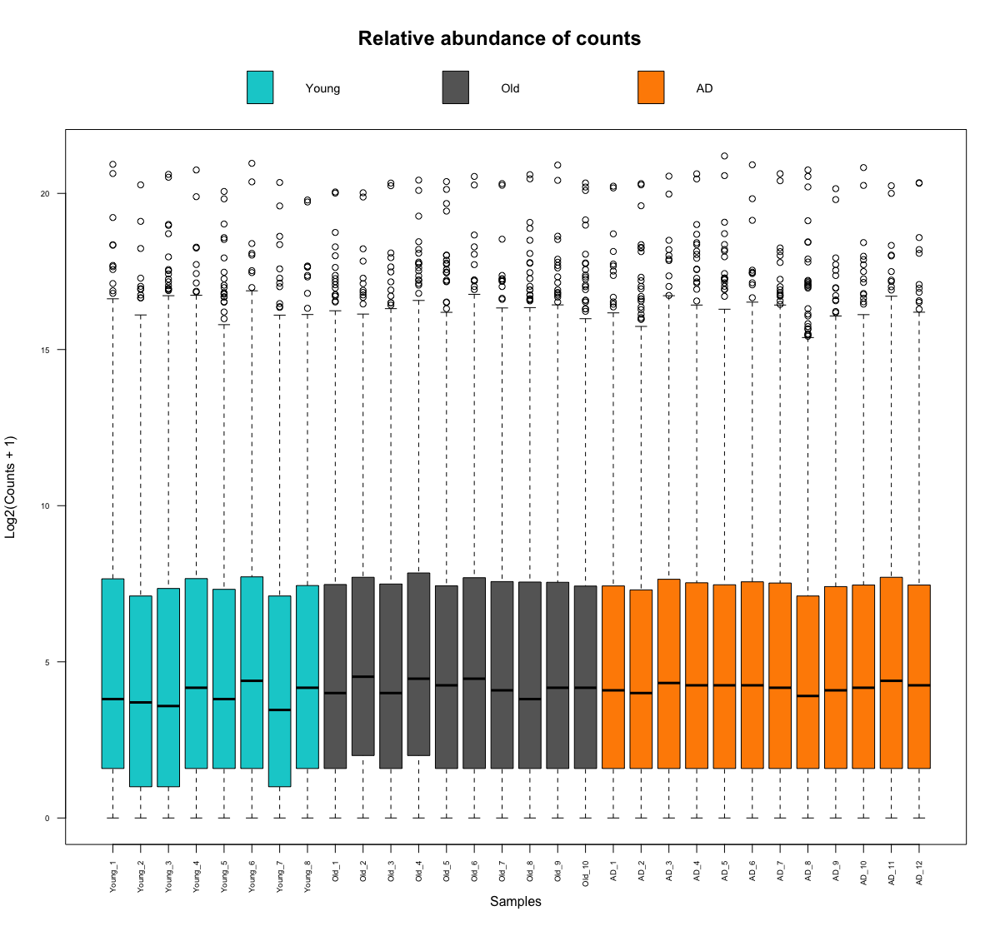

## Three-Way Comparison: Aging vs. Disease Effects

With three conditions available (Young, Old, AD), three pairwise contrasts 
were computed from the same fitted DESeq2 model:

| Contrast | Interpretation |
|---|---|
| Old vs Young | Pure aging effect (no disease) |
| AD vs Old | Disease-specific effect (controlling for baseline aging) |
| AD vs Young | Combined aging + disease effect |

## Sample-to-Sample Correlation

As an additional check of sample similarity, pairwise correlation between 
all 30 samples (based on VST-transformed counts) was visualized via 
heatmap with hierarchical clustering.

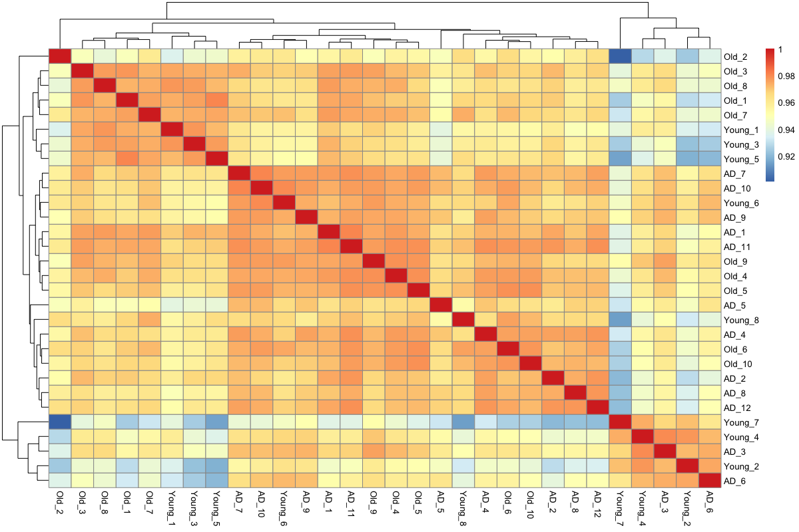

## PCA Exploration

Standard 2D PCA (PC1 vs. PC2) did not show clean separation between the 
three conditions (Young, Old, AD) — PC1 and PC2 together explained only 
~36% of total variance. 

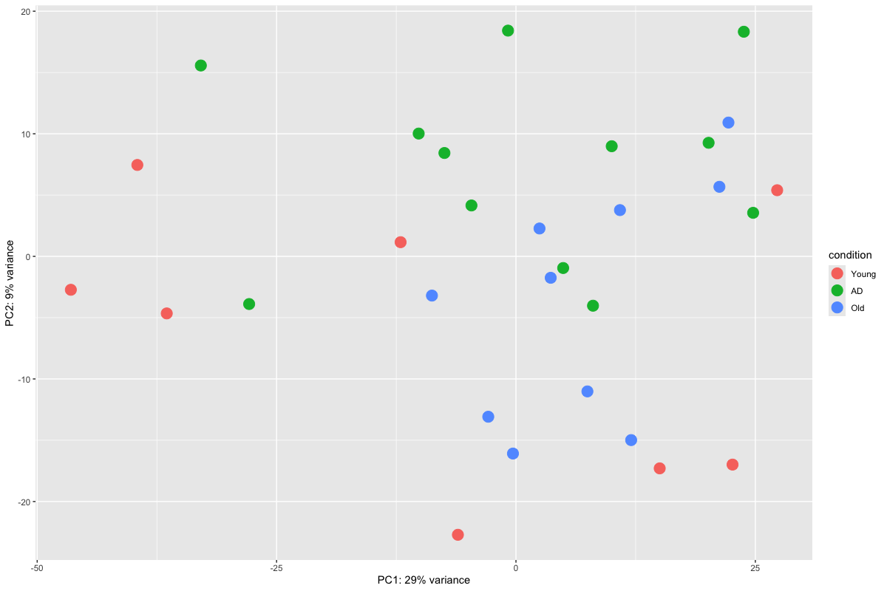

Examining the full variance distribution showed no single dominant 
component: reaching ~52% of cumulative variance required the first five 
principal components (PC1: 19.7%, PC2: 16.6%, PC3: 7.0%, PC4: 5.0%, 
PC5: 3.5%).

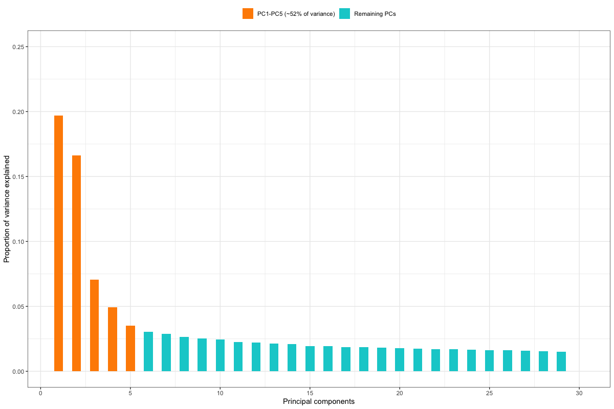

Visualizing the data across PC1–PC5 revealed somewhat clearer clustering 
by condition than PC1–PC2 alone, though separation remains incomplete.

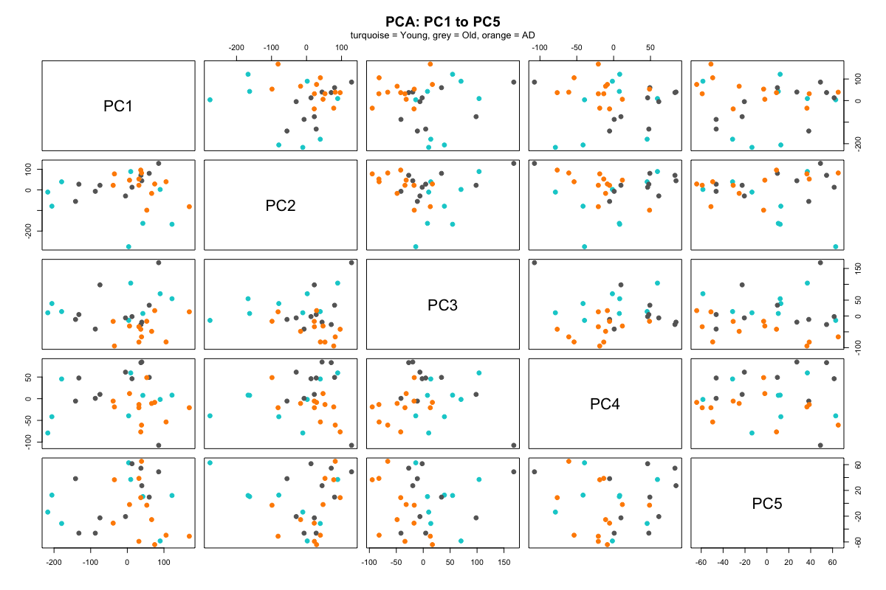

This is expected for human post-mortem tissue: each sample comes from a 
genetically distinct individual, and inter-donor genetic background 
contributes substantial biological variability on top of (and independent 
from) the condition being studied. Unlike model organisms or cell lines, 
there is no way to control for this source of variation by design — it is 
an inherent feature of working with human tissue. This is compounded by 
Alzheimer's being a multifactorial disease — mitochondrial dysfunction, 
neuroinflammation, protein metabolism alterations, and synaptic 
dysfunction likely each contribute distinct transcriptional signatures, 
rather than a single dominant axis of change. Results were essentially 
unchanged before and after adapter trimming (cumulative variance to PC5: 
~52% in both cases), indicating this pattern reflects genuine biological 
complexity rather than a technical artifact.

## Threshold Selection

Three significance thresholds were evaluated (padj<0.1, 0.05, 0.01) across 
all three pairwise contrasts. padj<0.1 was considered too permissive for 
confident reporting. At padj<0.01, DESeq2's independent filtering became 
unstable specifically for the Old vs Young contrast, collapsing to filter 
<0.1% of genes (vs. 60-68% at more permissive thresholds) and yielding 
implausibly few significant genes (7, down from 839 at padj<0.05) — a 
known failure mode of the filtering optimizer at strict alpha values, not 
a biological finding.

**padj<0.05 was therefore adopted as the reporting threshold**: the 
strictest value for which independent filtering behaved consistently 
across all three contrasts simultaneously.

## Log2FoldChange Shrinkage and Classification Threshold

log2FoldChange estimates were shrunk using DESeq2's `type="normal"` 
method, applied consistently across all three contrasts (rather than 
mixing apeglm/ashr per contrast, which would have required a legacy 
gfortran toolchain not compatible with this R installation) to preserve 
direct comparability between them.

Because `type="normal"` compresses fold-change estimates more 
aggressively than `apeglm`, the conventional |log2FC|>2 classification 
threshold no longer applied meaningfully. Comparing the log2FC 
distributions across all three contrasts confirmed this compression 
varied by contrast:

| Contrast | Median \|log2FC\| (padj<0.05) | 1st Quartile | Max |
|---|---|---|---|
| AD vs Old | 0.79 | 0.56 | 2.70 |
| Old vs Young | 0.56 | 0.45 | 1.05 |
| AD vs Young | 0.585 | 0.474 | 2.06 |

**|log2FC|>0.5 was adopted as the final threshold**, close to the median 
for all three contrasts and consistent enough to apply uniformly, rather 
than using contrast-specific thresholds that would complicate 
interpretation and comparison.

## Filtering to Protein-Coding Genes

This analysis focuses specifically on protein-coding genes, since the 
research question concerns protein-level biological function rather than 
non-coding RNA regulation. This is not an uncontested choice in the field:

- **Against a priori biotype filtering**: some practitioners argue that 
  excluding a class of RNA (lncRNA, pseudogenes, etc.) before analysis 
  presupposes that class has no biological role in the process under 
  study — a strong assumption not always justified.
- **For filtering, when appropriately scoped**: when the research question 
  is specifically about protein-coding biology (as here), restricting 
  results to protein-coding genes is defensible and common practice.

**Timing of the filter matters**: rather than filtering the count matrix 
to protein-coding genes before fitting the DESeq2 model, filtering was 
applied *after* running `results()`, to the results table only. This 
follows community guidance recommending that genes be filtered by 
expression level before model fitting (as already done via 
`rowSums(counts(data.dds)) >= 10`), with the model fit on the full 
filtered-by-expression gene set to preserve reliable dispersion estimates 
— and any additional biotype-based filtering applied afterward, to the 
results, rather than to the input matrix.

## Final Results Summary (protein-coding, padj<0.05, |log2FC|>0.5)

| Contrast | Down | Up | Total |
|---|---|---|---|
| Old vs Young | 465 | 30 | 495 |
| AD vs Old | 229 | 86 | 315 |
| AD vs Young | 2222 | 413 | 2635 |

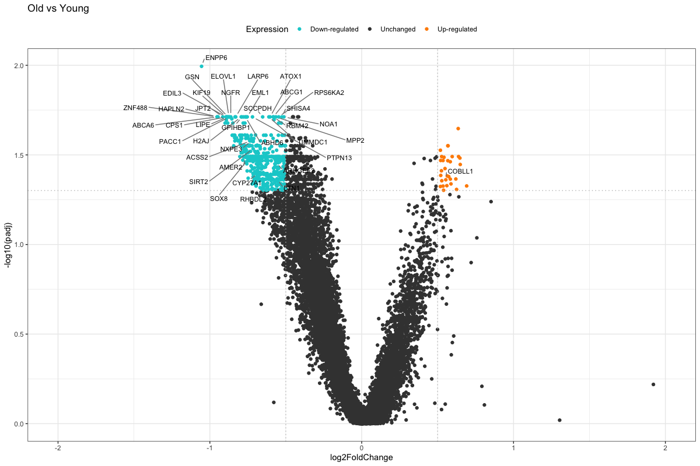

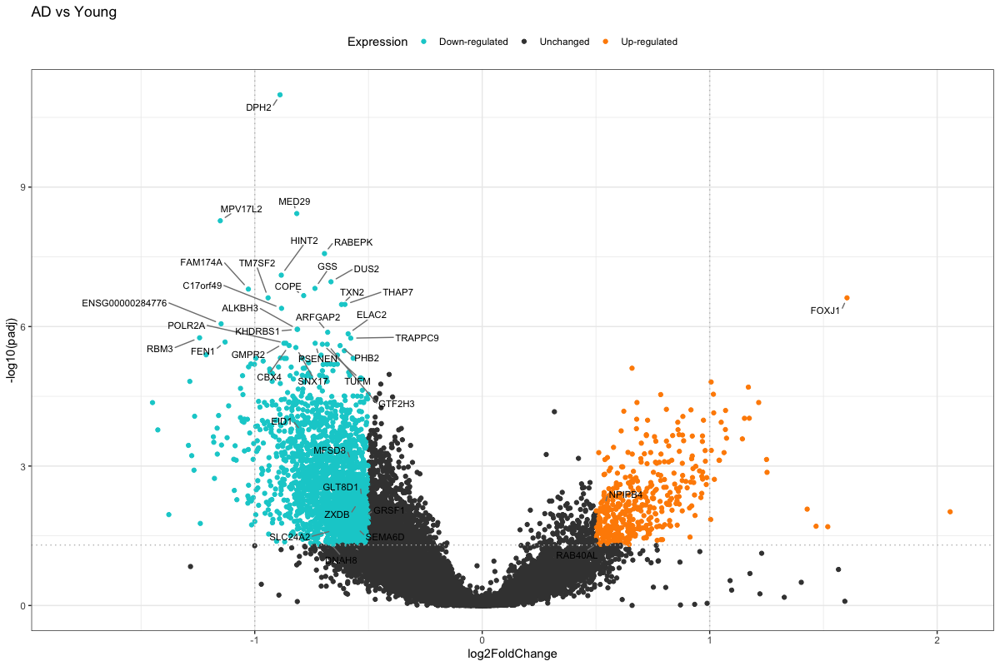

Old vs Young shows a strongly down-skewed pattern — a striking asymmetry 
suggesting that normal brain aging, at the protein-coding transcriptome 
level, is characterized predominantly by transcriptional decline rather 
than a mix of up- and down-regulated genes. AD vs Young shows 
substantially more differentially expressed genes than either aging or 
disease alone, suggesting a synergistic (non-additive) relationship 
between aging and disease-related transcriptional changes.

## Gene Overlap Across Comparisons

To assess whether aging and disease-specific transcriptional changes 
represent the same or distinct biological processes, significant genes 
(protein-coding, padj<0.05, |log2FC|>0.5) were compared across the three 
contrasts:

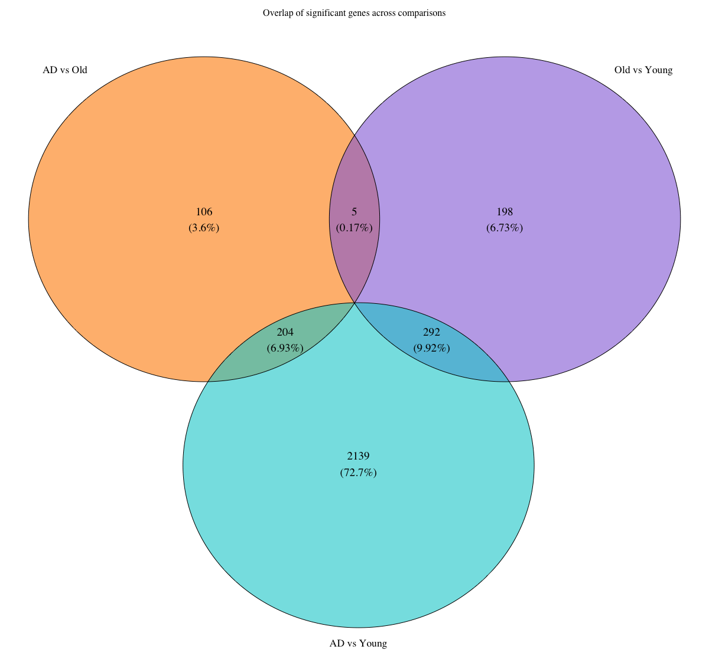

| Overlap | Genes |
|---|---|
| AD vs Old ∩ Old vs Young | 5 |
| AD vs Old ∩ AD vs Young | 204 |
| Old vs Young ∩ AD vs Young | 292 |
| All three contrasts | 0 |

**Almost no overlap exists between genes driven by pure aging and genes 
driven specifically by disease** — only 5 genes (NRIP2, SARDH, CYP2E1, 
DUSP6, KLF15) are shared between AD vs Old and Old vs Young, out of 
several hundred significant genes in each, and no gene is significant 
across all three comparisons. This supports the interpretation that 
Alzheimer's disease is not simply an acceleration of normal brain aging 
at the protein-coding transcriptome level, but instead involves 
substantially distinct biological processes.

## Combined Heatmap of Significant Genes

A heatmap combining the union of significant genes across all three 
contrasts (2,944 unique genes) was generated to visualize expression 
patterns across all 30 samples simultaneously.

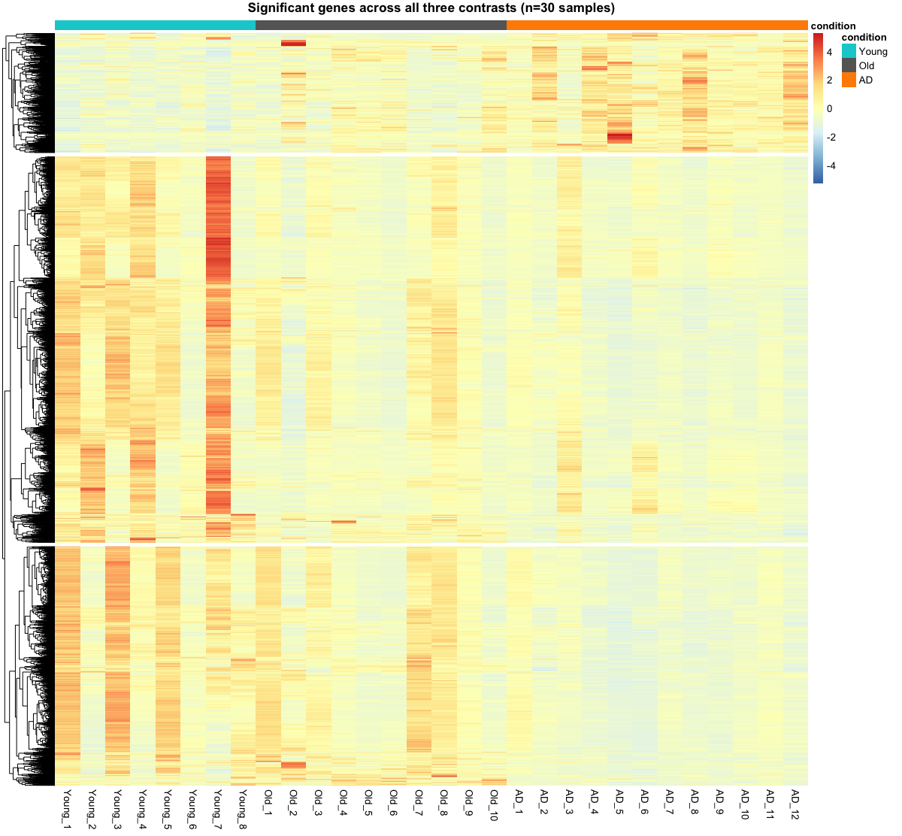

Because this heatmap combines genes selected from three separate 
contrasts, the color contrast per gene is naturally more subdued than a 
single-contrast heatmap would show. Despite this, clear condition-
associated patterns are visible: several Young samples (notably Young_7, 
Young_3, Young_1) show a distinct block of elevated expression that 
declines through Old and AD, while several samples (Old_2, AD_5) show 
elevated expression in a separate gene block — consistent with the 
condition-specific signals identified throughout this analysis.

## Biological Interpretation of Exclusive Gene Sets

Genes exclusive to each contrast (not significant in either of the other 
two) were examined for biological themes:

- **Old vs Young exclusive (198 genes)**: strongly enriched for 
  gliogenesis, oligodendrocyte differentiation, and axon 
  ensheathment/myelination (SOX8, SOX10, PLP1, CNTN2, CLDN11, NKX6-2; 
  p.adjust=7.6e-07 for gliogenesis, the most significant category), along 
  with sphingolipid metabolism (SPTLC2, SPTLC3) — consistent with known 
  myelin degradation processes in normal brain aging, independent of 
  disease.

- **AD vs Old exclusive (106 genes)**: enriched for tryptophan/kynurenine 
  pathway catabolism (IL4I1, BCAT2, KMO, SDS, GLUD1, KYAT1) and 
  leukocyte migration involved in inflammatory response (SELE, NLRP3, 
  ELANE) — notably including NLRP3, the gene encoding the NLRP3 
  inflammasome, a mechanism extensively studied in Alzheimer's-associated 
  neuroinflammation — the clearest disease-specific signal, controlling 
  for baseline aging.

- **AD vs Young exclusive (2,139 genes, the largest set)**: overwhelmingly 
  dominated by mitochondrial function and oxidative phosphorylation 
  (cellular respiration, p.adjust=8.7e-17 — the single most significant 
  category across all analyses in this repository), spanning dozens of 
  electron transport chain genes (NDUFA/NDUFB, COX, UQCR, ATP5 family, 
  SDHA/SDHB). Additional themes include ribosome biogenesis, the 
  ubiquitin-proteasome system, mitochondrial/ER protein import, cholesterol 
  biosynthesis (HMGCR, DHCR24), and autophagy. Mitochondrial dysfunction is 
  among the most well-established hallmarks of both aging and Alzheimer's 
  disease, and its dominance here reflects the combined, synergistic 
  effect captured by this contrast rather than either process alone.

## GO Enrichment: Genes Exclusive to AD vs Old

GO over-representation analysis of the 106 genes exclusive to the AD vs 
Old contrast (i.e., disease-specific changes not attributable to normal 
aging) showed consistent and reinforced enrichment in immune/inflammatory 
and amino acid metabolism processes:

- **Tryptophan/kynurenine pathway catabolism** (IL4I1, BCAT2, KMO, SDS, 
  GLUD1, KYAT1) — the most significant category (p.adjust=0.011), with a 
  pathway well established in the neuroinflammation literature
- **Leukocyte migration involved in inflammatory response** (SELE, NLRP3, 
  ELANE) — notably including **NLRP3**, the gene encoding the NLRP3 
  inflammasome, one of the most extensively studied neuroinflammatory 
  mechanisms in Alzheimer's disease (microglial inflammasome activation)
- **DNA-binding transcription activator activity** (TFCP2L1, EPAS1, EGR1, 
  FOSB, EGR4, KLF10, ETV4, FOXO4, SOX18)
- **Steroid/retinoid metabolism** (FABP5, SERPINA5, AKR1C2, DHRS11)

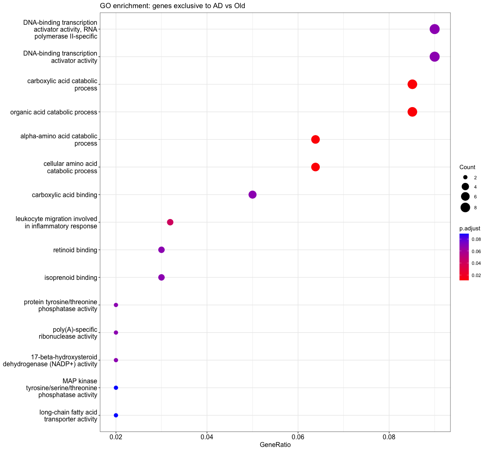

This immune/inflammatory signature — isolated from the effects of normal 
aging by design (via the three-contrast comparison strategy) — supports 
neuroinflammation, and specifically NLRP3 inflammasome activity, as a 
disease-specific process in this dataset, consistent with the broader 
literature on Alzheimer's pathophysiology.

## Biomarker Candidate Exploration

Nine genes from the immune/inflammatory and kynurenine pathway GO 
categories identified above (SELE, IL4I1, BCAT2, KMO, SDS, GLUD1, NLRP3, 
ELANE, KYAT1) were examined as exploratory biomarker candidates for 
distinguishing AD from Old (non-diseased, age-matched) samples.

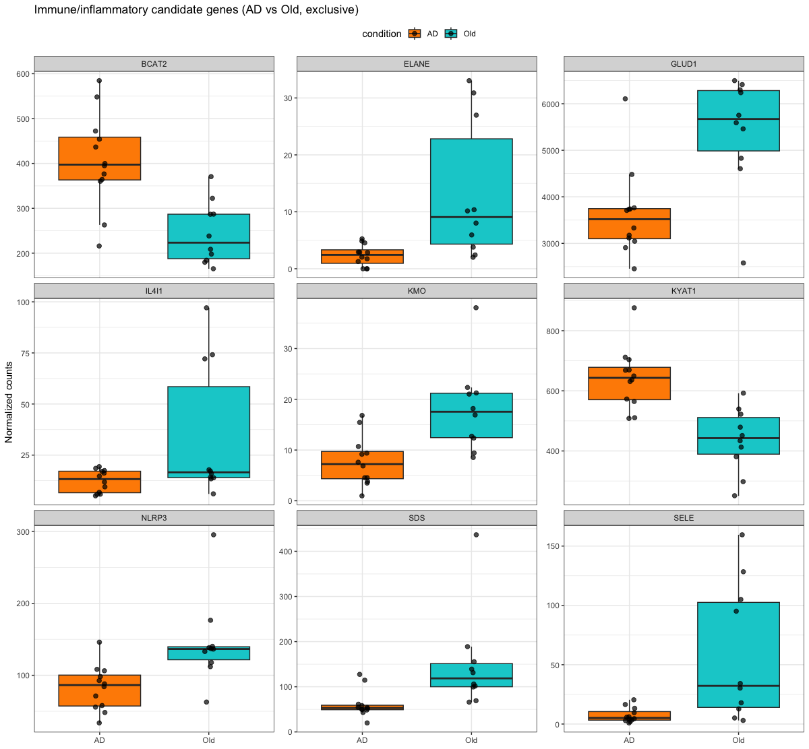

ROC/AUC analysis showed meaningful variation across genes (AUC 0.69–0.93), 
with KYAT1 (0.93), SDS (0.92), and BCAT2 (0.91) — all members of the 
kynurenine pathway — showing the strongest separation. NLRP3 also showed 
substantial discriminative power (AUC 0.875), notable given its 
well-established role in Alzheimer's-associated neuroinflammation, though 
its direction (down-regulated in AD, log2FC=-0.73) should be interpreted 
cautiously, as inflammasome activity does not necessarily correlate 
directly with transcript-level expression.

**This remains an exploratory analysis, not biomarker validation.** Genes 
were selected for being both statistically significant and exclusive to 
this contrast in this same dataset, then evaluated for discrimination in 
that same dataset — a circular design that will overestimate real-world 
predictive performance. Proper biomarker validation would require testing 
these candidates in an independent cohort not used for gene selection.

