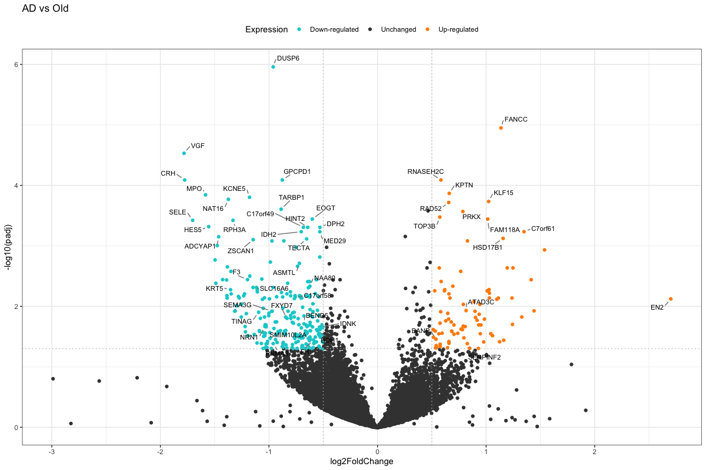

# Is Alzheimer's Just Accelerated Aging? The Data Says No.

*An RNA-seq investigation into aging, disease, and the inflammatory signature that separates them.*

## The Question

When a brain shows signs of Alzheimer's disease, how much of what we see 
is simply "old age, but more so" — and how much is something biologically 
distinct? This project re-analyzes public RNA-seq data from 30 human 
brain samples (young healthy, aged healthy, and Alzheimer's) to tease 
apart these two effects.

## The Finding

**Normal aging and Alzheimer's disease barely overlap at the gene level.** 
Comparing "aging alone" against "disease alone" (both measured against 
the same healthy baseline), almost no genes are shared between the two 
processes — out of hundreds of genes that change with each, only 5 
change in both.

The genes that change *specifically* with Alzheimer's — independent of 
age — point clearly toward **neuroinflammation**. Among them is 
**NLRP3**, the gene behind one of the most studied inflammatory 
mechanisms in Alzheimer's research: the NLRP3 inflammasome, a molecular 
switch that triggers brain inflammation. Alongside it, an entire cluster 
of genes from the **kynurenine pathway** — a route of tryptophan 
breakdown repeatedly linked to chronic neuroinflammation — showed some of 
the strongest signals in the whole analysis.



From this signature, nine genes stood out as promising exploratory 
biomarker candidates. Three kynurenine pathway genes — **KYAT1**, 
**SDS**, and **BCAT2** — showed the strongest ability to distinguish 
diseased from healthy-aged brain tissue in this dataset (AUC 0.91–0.93).

## Why It Matters

If Alzheimer's were simply "aging turned up," treatments targeting the 
aging process might be enough. Instead, this analysis adds to a growing 
body of evidence that the disease involves its own distinct biology — 
centered on inflammation — suggesting that disease-specific 
interventions, not just anti-aging ones, may be needed.

---

## How This Was Built

This repository performs the full RNA-seq workflow from raw sequencing 
reads — not pre-computed counts — reanalyzing a 2018 public dataset 
(GSE104704) against a current reference genome (GENCODE v47).

**Pipeline**: FastQC → fastp (adapter trimming) → salmon (pseudoalignment) 
→ tximport → DESeq2, run across all 30 samples (8 Young, 10 Old, 12 AD).

Three pairwise comparisons were computed from a single fitted model:

| Comparison | What it isolates |
|---|---|
| Old vs Young | Pure aging effect |
| AD vs Old | Disease effect, controlling for age |
| AD vs Young | Combined aging + disease effect |

See [METHODS.md](./METHODS.md) for full technical detail, including 
threshold selection, shrinkage method, protein-coding filtering rationale, 
and the complete gene overlap and enrichment analysis.

## Repository Structure
```
├── scripts/
│ ├── 00_setup_environment.sh # conda, salmon, reference index
│ ├── 01_get_metadata.R # sample metadata via recount3
│ ├── 02_download_and_quantify.sh # download, QC, trim, align (all 30 samples)
│ ├── 03_qc_mapping_rates.sh # mapping rate check
│ ├── 04_import_counts.R # tximport gene-level counts
│ ├── 05_qc.R # DESeq2, PCA, normalization
│ ├── 06_pca_multidim_exploration.R # multidimensional PCA exploration
│ ├── 07_volcano_plot.R # volcano plots, all 3 contrasts
│ ├── 08_venn_overlap.R # gene overlap + combined heatmap
│ ├── 09_go_exclusive_genes.R # GO enrichment on exclusive gene sets
│ └── 10_biomarker_candidates.R # biomarker candidate exploration
├── data/ # metadata, results, gene lists
└── figures/ # output plots
```

## Data Source

GSE104704 (GEO), reanalyzed from raw sequencing reads. See 
[data/README.md](./data/README.md) for details.

## Requirements

R packages: recount3, DESeq2, tximport, dplyr, ggplot2, pheatmap, 
org.Hs.eg.db, clusterProfiler, pROC, plotly, ggVennDiagram, VennDiagram

External tools: conda, salmon, fastp, FastQC, sra-tools

## License
MIT — see [LICENSE](./LICENSE)


